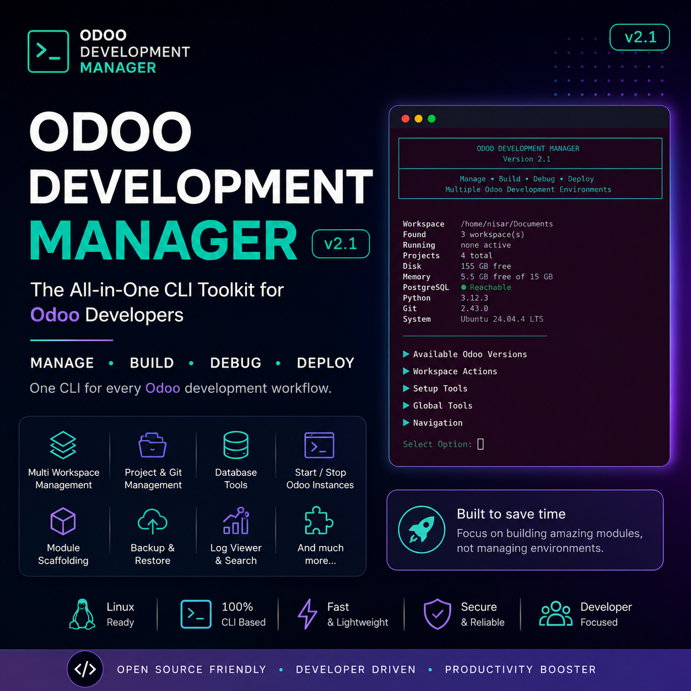
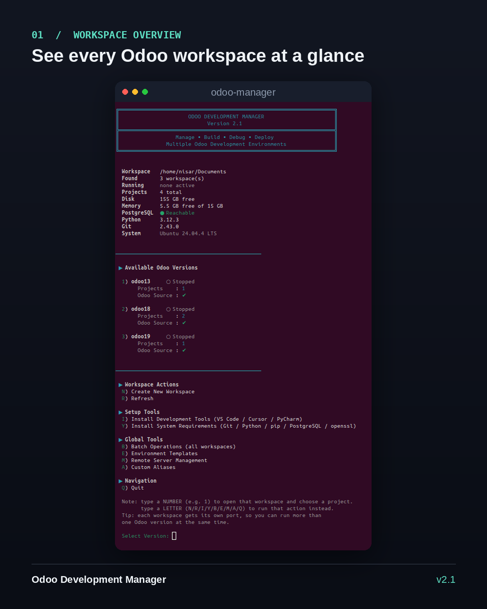
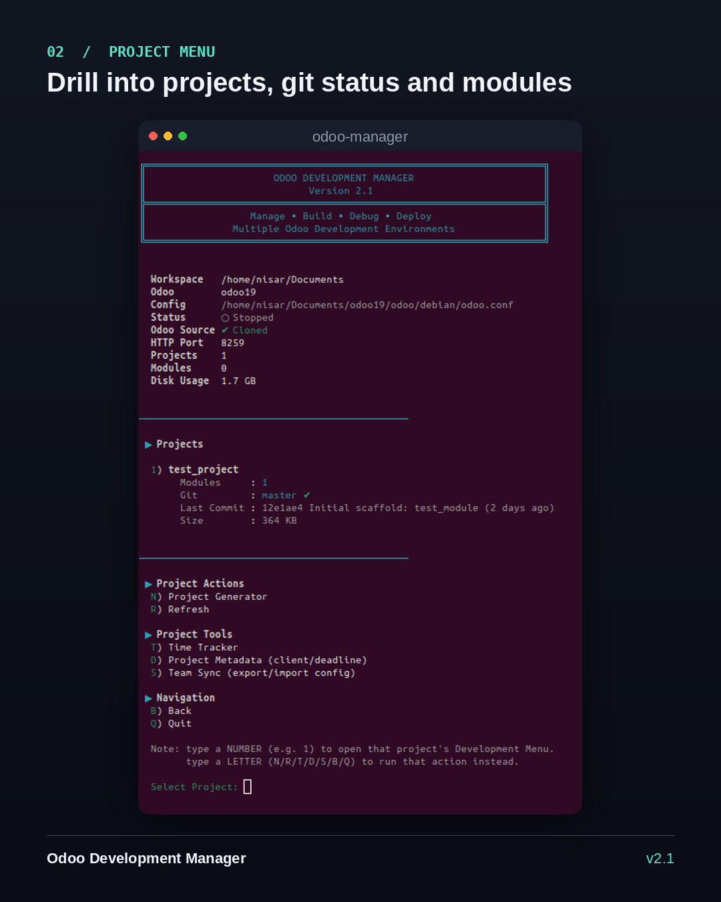
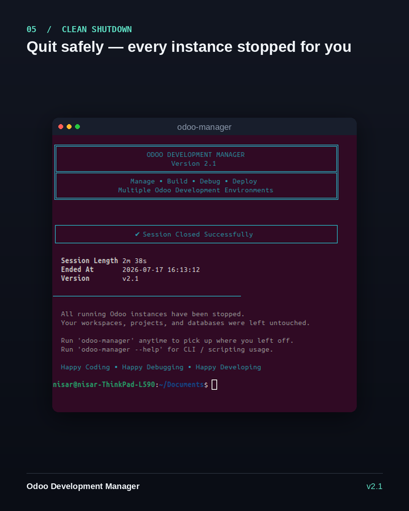
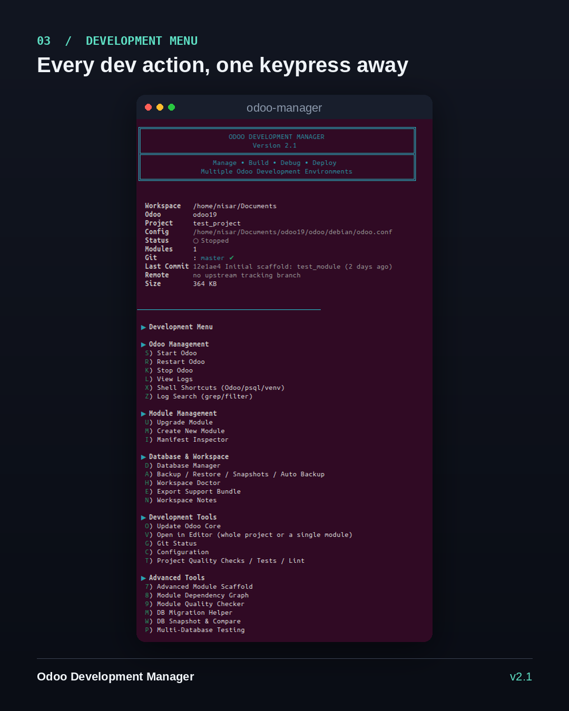

# Odoo Development Manager

<p align="center">
  
  
  
  
  
</p>

<p align="center">
  <strong>One command. Any Odoo version. Fully configured development environment in minutes.</strong>
</p>

<p align="center">
  
</p>

<p align="center">
A professional command-line tool that creates, runs, and manages multiple Odoo<br/>
development environments — from fresh install to running server, all automated.
</p>

---

## What is Odoo Development Manager?

**Odoo Development Manager** (`odoo-manager`) is a single CLI tool that automates
everything an Odoo developer normally does by hand. Instead of spending hours
cloning Odoo, configuring Python versions, setting up virtual environments,
writing `odoo.conf`, managing ports, juggling databases, and installing editors
— you run one command and the tool handles it all through a guided interactive
menu.

### Who is this for?

- **Odoo Developers** — Stop repeating the same setup steps for every project.
  Create a fully working workspace for any Odoo version (13 through 19) in
  under 5 minutes.
- **Team Leads** — Standardize development environments across your team.
  Export/import workspaces, share config profiles, enforce consistent setups.
- **Freelancers** — Manage multiple client projects across different Odoo
  versions without conflicts. Each workspace runs on its own isolated port.
- **Companies** — Onboard new developers instantly. They install the tool,
  enter their license key, and have a running Odoo dev environment the same
  day — no senior developer needed to walk them through setup.

### What problem does it solve?

Setting up an Odoo development environment manually involves:

1. Installing the right Python version (each Odoo version needs a different one)
2. Cloning Odoo Community (and optionally Enterprise)
3. Creating and configuring a virtual environment
4. Installing dozens of Python dependencies (with version-specific quirks)
5. Writing `odoo.conf` with correct ports, addons paths, database credentials
6. Setting up PostgreSQL users and databases
7. Installing development tools (VS Code, Git, etc.)
8. Managing multiple projects and modules across workspaces
9. Keeping track of which port belongs to which Odoo instance

**This tool does all of that automatically** — and gives you a dashboard,
git integration, database manager, backup system, log viewer, editor
shortcuts, workspace doctor, and much more on top.

---

## Table of Contents

- [Installation](#installation)
- [License Activation](#license-activation)
- [Quick Start](#quick-start)
- [Features](#features)
- [Dashboard](#dashboard)
- [Workspace Wizard](#workspace-wizard)
- [Multi-Instance Support](#multi-instance-support)
- [Project Generator](#project-generator)
- [Database Manager](#database-manager)
- [Server Control](#server-control)
- [Git Integration](#git-integration)
- [Module Management](#module-management)
- [Editor Integration](#editor-integration)
- [Development Tools Installer](#development-tools-installer)
- [System Requirements Installer](#system-requirements-installer)
- [Workspace Doctor](#workspace-doctor)
- [Backup and Restore](#backup-and-restore)
- [Auto Backup Scheduler](#auto-backup-scheduler)
- [Environment Export and Import](#environment-export-and-import)
- [Config Profiles](#config-profiles)
- [Log Management](#log-management)
- [Shell Shortcuts](#shell-shortcuts)
- [Log Search](#log-search)
- [Manifest Inspector](#manifest-inspector)
- [Test and Lint Runner](#test-and-lint-runner)
- [System Resource Check](#system-resource-check)
- [Workspace and Project Notes](#workspace-and-project-notes)
- [Plugin System](#plugin-system)
- [Advanced Tools](#advanced-tools)
- [Secrets Separation (.env)](#secrets-separation-env)
- [Enterprise Auto-Detection](#enterprise-auto-detection)
- [Non-Interactive CLI Mode](#non-interactive-cli-mode)
- [Shell Tab-Completion](#shell-tab-completion)
- [Updating](#updating)
- [User Manual](#user-manual)
- [Environment Variables](#environment-variables)
- [Workspace Structure](#workspace-structure)
- [Project Structure](#project-structure)
- [Uninstalling](#uninstalling)
- [Troubleshooting / FAQ](#troubleshooting--faq)
- [License](#license)
- [Support](#support)

---

## Installation

Run this single command in your terminal:

```bash
bash <(curl -fsSL https://raw.githubusercontent.com/NisarZaidi/odoo-manager-releases/main/install.sh)
```

> **Important:** Use `bash <(curl ...)` exactly as shown — **not** `curl ... | bash`.
> The installer asks for your license key interactively, and piping into
> `bash` steals your terminal's input, so the prompt would never appear.
> `bash <(curl ...)` keeps your keyboard input working normally.

### What the installer does:

1. Checks for `curl`, `tar`, `openssl` on your system
2. Downloads the latest release package
3. Asks for your **license key** (see [License Activation](#license-activation))
4. Installs system requirements (Git, Python 3, pip, PostgreSQL, build tools, etc.)
5. Installs `odoo-manager` to `~/.local/bin` and adds it to your `PATH`
6. Sets up Bash/Zsh tab-completion automatically

Once installed, just run:

```bash
odoo-manager
```

### Requirements

- **Linux only** (Debian / Ubuntu — installer uses `apt-get`)
- `bash`, `curl`, `tar`, `openssl` (needed to run the installer)

That's it. Everything else — **Git, Python 3, pip, PostgreSQL, build tools**
— is checked automatically and can be installed for you with one confirmation.

---

## Licensing & Free Tier

Odoo Development Manager offers a **free tier** for the first 100 developers, plus a
**paid pro tier** with access to all advanced tools.

### Free Tier (First 100 Developers)

During installation, choose **Option 1 — Free Tier** and register with your name
and email. You get a lifetime license key (`ODM-FREE-XXXX-XXXX`) with access to:

- Workspace management (create, start, stop Odoo environments)
- Database manager (create, drop, backup, restore, clone)
- Git integration (status, commit, push, pull, stash)
- Module management (create, upgrade, manifest inspector)
- Config profiles, workspace notes, time tracker
- Environment export/import

### Pro Tier (Paid)

Upgrade to unlock all advanced tools:

- Advanced Module Scaffold (full boilerplate wizard)
- Module Dependency Graph
- Module Quality Checker (score 0-10)
- Batch Operations (start/stop/backup all workspaces)
- Hot Reload (auto-restart on file changes)
- DB Migration Helper
- DB Snapshot & Compare
- Multi-Database Testing
- Remote Server Management

### How It Works

1. Run the installer → choose Free or Paid
2. **Free**: Enter name + email → get instant license key
3. **Paid**: Paste the `ODM-PRO-XXXX-XXXX` key you received
4. Key verified online via Supabase (with offline grace period)
5. Tier cached locally — no repeated prompts

### How to Get a License

| Option | How |
|---|---|
| **Free Tier** | Self-service during install (name + email required) |
| **Pro Tier** | Contact the developer: **nisarzaidi75@gmail.com** / **+92-301-2122387** |
| **CLI Register** | Already installed? Run: `odoo-manager register` |
| **Check Tier** | Run: `odoo-manager license-status` |

---

## Quick Start

```bash
odoo-manager
```

That's it — the interactive wizard takes over:

1. **First run, no workspaces found** → Guided wizard: pick an Odoo version
   (13–19), it clones Odoo Community, creates a Python virtual environment
   with the correct Python version, installs all dependencies, and generates
   a working `odoo.conf`.
2. **Create a project** → Use **Project Generator** to scaffold a new
   project folder, optionally as a git repo, optionally with a first module
   already created.
3. **Start Odoo** → One keypress. Your browser-ready Odoo instance is
   running on its own dedicated port.

---

## Features

### Complete Feature List

| Category | Feature | Description |
|---|---|---|
| **Core** | Interactive CLI | Full menu-driven interface with keyboard shortcuts |
| | Multi-Workspace | Manage multiple Odoo environments side by side |
| | Odoo 13 – 19 | Support for all modern Odoo versions |
| **Setup** | Workspace Wizard | Guided setup: clones Odoo, creates venv, generates config |
| | Auto Python Version | Correct Python version selected per Odoo version via pyenv |
| | Auto Dependency Install | `requirements.txt` installed with smart retry and version ceilings |
| **Server** | Start / Stop / Restart | Reliable readiness check (not a blind timer) |
| | Multi-Instance | Run Odoo 13–19 simultaneously, each on its own port |
| | Auto Port Assignment | Unique HTTP + longpolling ports per Odoo version |
| | Port Conflict Detection | Refuses to start if port is busy, tells you exactly which one |
| | Auto Shutdown | Quitting stops ALL running Odoo instances across all workspaces |
| **Projects** | Project Generator | Create folder + optional git init + optional first module |
| | Module Scaffold | Create new modules via `odoo-bin scaffold` |
| | Module Upgrade | Upgrade modules against any database from the menu |
| | Manifest Inspector | Inspect `__manifest__.py` files for issues |
| | Favorites & Recents | Quick access to frequently used workspaces and projects |
| **Database** | Full DB Manager | List, create, duplicate, backup, restore, drop databases |
| | Clone DB & Run | One-click: duplicate database + restore + start Odoo |
| | Pre-Drop Safety | Automatic backup before dropping any database |
| **Backup** | Workspace Backup | Archive addons, enterprise, projects, config |
| | Snapshots | Point-in-time package with doctor report + optional DB dump |
| | Auto Backup | Cron-based scheduled backups with retention cleanup |
| | Support Bundle | Export config + logs + system info for troubleshooting |
| | Environment Export/Import | Migrate workspaces between machines |
| **Git** | Branch/Status Badges | Per-project git status at a glance |
| | Commit & Push | Stage, commit, push — all without leaving the tool |
| | Smart Pull | Auto-stash before pull, pop after — no merge conflicts |
| | Stash Push/Pop | Save and restore work-in-progress |
| | Recent Log | View last commits |
| **Editors** | Open in VS Code | Open whole project or specific module |
| | Open in Cursor | Open whole project or specific module |
| | Open in PyCharm | Open whole project or specific module |
| | Auto-Install Editors | Install VS Code / Cursor / PyCharm from within the tool |
| **Diagnostics** | Workspace Doctor | Health check + auto-repair for common issues |
| | Dashboard | Unified overview of all workspaces |
| | System Resource Check | CPU, memory, disk, PostgreSQL status |
| | JSON Output | Machine-readable output for status, list, doctor commands |
| **Logging** | Live Log Viewer | Auto-rotating, follows across rotation |
| | Log Search | Interactive grep/filter by term or log level |
| | Auto Rotation | Configurable size limit and backup count |
| **Configuration** | Dynamic Addons Path | Automatically detects and includes real module directories |
| | Config Profiles | Save/load named presets (dev, staging, prod) |
| | Enterprise Detection | Auto-detects Odoo Enterprise modules |
| | Secrets (.env) | Store passwords outside of version-controlled config |
| **Automation** | CLI Mode | Non-interactive commands for scripts, cron, CI |
| | Quick Aliases | `open`, `logs`, `shell`, `psql`, `test`, `lint` |
| | Update Checker | Checks GitHub for newer versions on startup |
| **Extensibility** | Plugin System | Drop `.sh` files to add custom commands |
| | Tab Completion | Bash + Zsh auto-completion for all commands |
| **Developer UX** | Shell Shortcuts | Quick access to Odoo/psql/venv/bash shells |
| | Test Runner | pytest / unittest / Odoo test framework |
| | Lint Runner | flake8 / pylint integration |
| | Notes | Per-workspace and per-project persistent notes |
| **Licensing** | Offline Verification | RSA-signed keys, no internet required |
| | Lifetime Keys | One-time purchase, no subscription |
| **Advanced Tools** | Hot Reload | Auto-restart Odoo when code files change |
| | Advanced Module Scaffold | Full boilerplate with models, views, security, wizards, controllers |
| | Module Dependency Graph | Visualize and check module dependencies |
| | Module Quality Checker | Score modules 0–10 with issue detection |
| | Batch Operations | Start/stop/backup all workspaces at once |
| | Environment Templates | Save and restore workspace configurations |
| | Time Tracker | Track hours per project with CSV export |
| | Project Metadata | Store client name, description, deadline per project |
| | Custom Aliases | User-defined command shortcuts |
| | Team Sync | Share workspace config as JSON via git |
| | Remote Server Management | Control remote Odoo instances via SSH |
| | DB Migration Helper | Compatibility check for version upgrades |
| | DB Snapshot & Compare | Schema snapshots and diff between databases |
| | Multi-Database Testing | Test modules against multiple databases |
| | Desktop Notifications | Alerts for start/stop/crash/backup events |

---

## Dashboard

From the Development Menu, press **1** for a unified overview showing:

<p align="center">
  
</p>

- All workspaces with running/stopped status and port badges
- Per-workspace project and module counts
- Health indicators and favorite markers
- Total counts (workspaces, running instances, projects, modules)
- PostgreSQL reachability status
- Disk usage warnings (high usage shown in red)

---

## Workspace Wizard

The workspace wizard is a guided 7-step flow that creates a complete Odoo
development environment from scratch:

```
Step 1: Create workspace folders (odoo, enterprise, projects, logs, backup)
Step 2: Clone Odoo Community (correct branch for your version)
Step 3: Create Python virtual environment (correct Python version via pyenv)
Step 4: Install Python dependencies (smart per-package install with retry)
Step 5: Create log directory
Step 6: Generate odoo.conf (ports, addons path, database credentials)
Step 7: Create your first project (optional)
```

### Supported Odoo Versions

Odoo 13 through 19. If the exact `<version>.0` branch is not found on GitHub,
the wizard automatically searches for the closest matching branch.

### Python Version Mapping

Each Odoo version automatically gets the correct Python version:

| Odoo Version | Python Version |
|---|---|
| 13, 14 | 3.8.20 |
| 15, 16, 17 | 3.10.14 |
| 18 | 3.11.9 |
| 19 | 3.12.6 |

---

## Multi-Instance Support

Every workspace gets its own HTTP and longpolling port, calculated from
its Odoo version, so multiple versions can run **at the same time** without
clashing:

| Odoo Version | HTTP Port | Longpolling Port |
|---|---|---|
| 13 | 8199 | 8202 |
| 14 | 8209 | 8212 |
| 15 | 8219 | 8222 |
| 16 | 8229 | 8232 |
| 17 | 8239 | 8242 |
| 18 | 8249 | 8252 |
| 19 | 8259 | 8262 |

If a port is already taken by something else, **Start Odoo** refuses to
start and tells you exactly which port is busy instead of failing silently.

Quitting the manager (`Q` or `Ctrl+C`) stops **every** running Odoo instance
across every workspace — not just the one you were last in — so nothing keeps
running in the background after you exit. All workspaces shut down in parallel
for speed.

---

## Project Generator

From the Projects screen, press **N** for a guided flow to create a new project:

<p align="center">
  
</p>

1. Validates and creates the project folder under `projects/`
2. Optionally initializes it as its own git repository
3. Optionally scaffolds a first module (`odoo-bin scaffold`)
4. Optionally makes the initial commit if both git and a module were set up

---

## Database Manager

From the Development Menu, press **D** for full PostgreSQL database management,
scoped to the current workspace:

```
1) List Databases
2) Create Database
3) Duplicate Database
4) Backup Database       (pg_dump, saved to <workspace>/backup/)
5) Restore Database       (pg_restore, pick from existing backups)
6) Drop Database          (with pre-drop safety backup)
7) Clone Database & Run   (one-click: duplicate + restore + start Odoo)
```

**Pre-Drop Safety**: Before dropping any database, the manager offers to
create a `pg_dump` backup automatically. If the backup fails, it warns and
asks for confirmation before proceeding.

---

## Server Control

### Starting Odoo

The server is started with a reliable readiness check — the tool polls the
Odoo HTTP endpoint until it actually responds, rather than using a blind
timer. Once Odoo is ready, your browser opens automatically to the database
manager.

### Stopping Odoo

Individual workspaces can be stopped from the menu. When you quit the
manager, **all** running instances across **all** workspaces are stopped
in parallel background jobs.

<p align="center">
  
</p>

### Restarting

One-key restart that stops and starts Odoo cleanly, preserving your
session context.

---

## Git Integration

The project list shows a git badge next to each project:

```
1) agri
     Modules : 4    Git : main ✔

2) hospital
     Modules : 2    Git : dev ●3
```

From the Development Menu, press **G** for a full Git Status screen:

- **Pull Latest** — with smart auto-stash (stashes uncommitted changes
  before pulling, pops them after — prevents merge conflicts)
- **Full Status** — `git status` output
- **Recent Log** — last commits with dates
- **Commit & Push** — stage all or specific files, commit with message,
  push (offers to set upstream on first push)
- **Stash Push / Pop** — save and restore work-in-progress

---

## Module Management

- **Scaffold**: Create new modules with `odoo-bin scaffold` from the menu
- **Upgrade**: Upgrade modules against any database with one keypress
- **Manifest Inspector**: Press **I** to inspect all `__manifest__.py`
  files in the current project — shows name, version, summary, depends,
  data files, and highlights potential issues

---

## Editor Integration

From the Development Menu, press **V** to open your project in an editor.
Choose what to open:

```
1) Whole Project
2) A Specific Module
```

Then which editor:

```
1) VS Code
2) Cursor
3) PyCharm
```

If the chosen editor is not installed, you will be offered to install it
on the spot.

---

## Development Tools Installer

From the workspace list, press **I** to install development editors with
one click — no need to browse the web:

```
1) VS Code            (official Microsoft apt repository)
2) Cursor              (official AppImage, linked into ~/.local/bin)
3) PyCharm Community   (snap install, falls back to JetBrains tarball)
A) Install All Missing
```

Each entry shows a live installed/not-installed badge. Linux (Debian/Ubuntu)
only.

---

## System Requirements Installer

From the workspace list, press **Y** to install or repair system dependencies:

```
1) Git
2) Python 3 (with venv)
3) pip
4) PostgreSQL
5) openssl
6) build tools (build-essential)
A) Install All Missing
```

Also runs automatically as a blocking check the first time `odoo-manager`
is launched.

---

## Workspace Doctor

From the Development Menu, press **H** for a comprehensive health check
that can diagnose and auto-repair common issues:

- Broken or missing workspace folders
- Stale PID files from crashed Odoo instances
- Incorrect `addons_path` in `odoo.conf`
- Python version mismatches (wrong venv for the Odoo version)
- Port conflicts
- Missing configuration files
- Enterprise folder issues

The doctor runs automatically and offers to fix anything it finds.

---

## Backup and Restore

From the Development Menu, press **A** for the Backup menu.

**Backup** archives: `custom_addons/`, `enterprise/`, `projects/`,
`odoo/debian/odoo.conf`. The Odoo source (`odoo/`) and Python virtual
environment (`env/`) are excluded by design (they can be re-cloned/re-created).

Backups are saved as timestamped `.tar.gz` files in the workspace's
`backup/` folder.

**Snapshots** create a richer point-in-time package in `snapshots/`:

- Workspace payload archive
- Workspace doctor JSON report
- Optional PostgreSQL dump

Use **E** in the Development Menu to export a **Support Bundle** with
config, log tail, doctor JSON, system info, and git context — useful
when asking for help.

---

## Auto Backup Scheduler

From the Backup menu (**A**), set up automated cron-based backups:

```
5) Auto Backup Status       (show current cron schedule)
6) Setup Auto Backup (cron)  (daily/weekly/custom interval)
7) Disable Auto Backup       (remove cron entry)
8) Backup Retention Cleanup  (delete backups older than N days)
```

- Backs up all non-template PostgreSQL databases on schedule
- Auto-deletes old backup files based on retention policy
- Managed via a generated cron script

---

## Environment Export and Import

From the Development Menu, press **5** to export and **6** to import
workspace environments:

- **Export**: Archives workspace config, modules, project structure, and
  notes into a portable `.tar.gz`
- **Import**: Restores a previously exported environment on a different
  machine or workspace

Useful for migrating between machines, sharing workspace setups with team
members, or creating reproducible dev environments.

---

## Config Profiles

From the Development Menu, press **2** to manage configuration presets:

- **Save** current workspace config as a named profile (e.g., `dev`,
  `staging`, `prod`)
- **Load** a saved profile to quickly switch between configurations
- **List** all saved profiles with their settings summary

Profiles are stored per-workspace in `<workspace>/config_profiles/`.

---

## Log Management

### Live Log Viewer

From the Development Menu, press **L** to tail the Odoo log in real-time.
The viewer follows across log rotation automatically.

### Log Rotation

`odoo.log` is automatically rotated once it crosses a size limit. Old logs
are kept as `odoo.log.1`, `odoo.log.2`, etc.

Defaults: **20MB per file, 5 backups kept**. Override with environment
variables:

```bash
LOG_MAX_SIZE_MB=50 LOG_MAX_BACKUPS=10 odoo-manager
```

---

## Shell Shortcuts

From the Development Menu, press **X** for quick access to common shells:

```
1) Odoo Shell        (python3 odoo-bin shell with config loaded)
2) psql Shell         (PostgreSQL, pick a database)
3) Python Venv Shell  (source env/bin/activate)
4) Regular Bash Shell (in project directory)
```

---

## Log Search

From the Development Menu, press **Z** for interactive log searching:

- Enter a search term (grep-style) to filter `odoo.log`
- Supports case-insensitive search and regex patterns
- Shows matches with line numbers and surrounding context
- Filter by log level (ERROR, WARNING, INFO)

---

## Manifest Inspector

From the Development Menu, press **I** to inspect all `__manifest__.py`
files in the current project:

- Displays: name, version, summary, category, author, license, depends
- Shows installable and auto_install flags
- Lists data/security XML files referenced
- Highlights potential issues (missing fields, broken dependencies)

---

## Test and Lint Runner

From the Development Menu, press **T** then choose:

```
5) Run Tests    (pytest / unittest / Odoo test framework)
6) Lint Check   (flake8 / pylint)
```

- Auto-detects available test frameworks in the project's venv
- Runs tests scoped to the current project's modules
- Lint checks Python files with configurable tools
- Also accessible via CLI: `odoo-manager test` and `odoo-manager lint`

---

## System Resource Check

From the Development Menu, press **3** to run a system health check:

- CPU load average and warning threshold
- Memory usage (free vs total)
- Disk space (with warnings at 85%+ usage)
- PostgreSQL connectivity status
- Python and Git version info

---

## Workspace and Project Notes

From the Development Menu, press **N** to manage persistent notes:

- **Workspace notes**: TODOs, reminders, context for the whole workspace
- **Project notes**: Per-project notes stored alongside

Notes are stored in `~/.local/share/odoo-manager/notes/` and persist
across sessions.

---

## Plugin System

Drop custom `.sh` files into the `plugins/` directory (installed at
`~/.local/share/odoo-manager/plugins/`) to extend the manager with
your own commands and menu items:

```
plugins/
├── my-deploy.sh       # sourced automatically on startup
├── custom-reports.sh  # add your own functions
└── team-shortcuts.sh  # team-specific aliases
```

All `.sh` files in `plugins/` are sourced after the core libraries load,
so they have access to all internal functions.

---

## Advanced Tools

<p align="center">
  
</p>

### Hot Reload (Auto-Restart on File Changes)

Start Odoo with file watching — any change to `.py`, `.xml`, or `.csv` files in your project automatically restarts the server. No more manual restarts after every code edit.

- **Menu:** Press **S** then **2** in the Development Menu
- **Requirement:** `inotify-tools` (auto-installs on first use)

### Advanced Module Scaffold

Create production-ready Odoo modules with best-practice boilerplate:
- Full module structure: models, views, security, wizards, controllers
- `__manifest__.py` with proper dependencies and data files
- Security groups + access rules (`ir.model.access.csv`)
- Tree, Form, and Search views with statusbar and chatter
- Optional wizard and controller scaffolding

**Menu:** Press **7** | **CLI:** `odoo-manager scaffold --workspace <name>`

### Module Dependency Graph

Visualize dependencies between all modules in your project:
- Shows local (in-project) vs external dependencies as a tree
- Detects circular dependencies automatically

**Menu:** Press **8** | **CLI:** `odoo-manager deps --workspace <name>`

### Module Quality Checker

Scans all modules and gives a quality score (0–10):
- Missing `__manifest__.py` fields (name, description, license, author)
- `print()` statements that should use `logging` instead
- Bare `except:` clauses (should catch specific exceptions)
- Missing `# -*- coding: utf-8 -*-` headers
- Missing security access files

**Menu:** Press **9** | **CLI:** `odoo-manager quality --workspace <name>`

### Batch Operations

Perform actions across all workspaces simultaneously:
- Start all workspaces
- Stop all workspaces
- Backup all databases
- Upgrade a module across all workspaces

**Menu:** Press **B** (Workspace screen) | **CLI:** `odoo-manager batch`

### Environment Templates

Save and restore workspace configurations as reusable templates:
- Save current workspace setup (Odoo version, projects, ports)
- Load templates to quickly create new workspaces with the same structure
- Delete old templates

**Menu:** Press **E** (Workspace screen) | **CLI:** `odoo-manager templates`

### Per-Project Time Tracker

Track time spent on each project for billing and productivity:
- Start/stop tracking per project
- View reports with session history
- Export to CSV for invoicing

**Menu:** Press **T** (Project screen) | **CLI:** `odoo-manager timetrack`

### Client/Project Metadata

Store project-level information:
- Client name, project description, deadline
- Automatic deadline warnings (overdue or approaching)
- View all project metadata across workspaces

**Menu:** Press **D** (Project screen)

### Custom Command Aliases

Define your own shortcut commands for frequently used operations:
- Map complex commands to simple names
- Example: `dev = start --workspace odoo18 --project agri`
- Run with: `odoo-manager <your-alias-name>`

**Menu:** Press **A** (Workspace screen) | **CLI:** `odoo-manager aliases`

### Team Sync

Share workspace configuration with team members:
- Export workspace setup as JSON (commits to git)
- Team members import to replicate project structure on their machines

**Menu:** Press **S** (Project screen)

### Remote Server Management

Manage remote Odoo instances via SSH:
- Start/stop/restart remote Odoo
- View remote logs (tail -f)
- Check remote server status
- Add multiple remote servers

**Menu:** Press **M** (Workspace screen) | **CLI:** `odoo-manager remote`

### DB Migration Helper

Assists with Odoo version upgrades:
- Module compatibility check for target Odoo version
- Deprecation detection (`openerp` imports, `@api.multi`, `@api.one`)
- Step-by-step migration checklist (preparation, code, data, go-live)

**Menu:** Press **M** | **CLI:** `odoo-manager migration`

### DB Snapshot & Compare

Take database schema snapshots and compare between versions:
- Snapshot schema before/after module upgrades
- Detect new or removed tables
- Show detailed schema diff

**Menu:** Press **W** | **CLI:** `odoo-manager dbcompare`

### Multi-Database Testing

Test a module against multiple databases:
- Add test databases (e.g., production copies)
- Run module upgrade test against all databases
- Pass/fail report per database

**Menu:** Press **P** | **CLI:** `odoo-manager multitest`

### Desktop Notifications

Receive desktop notifications for important events:
- Odoo started/stopped/crashed
- Backup complete
- Long tasks finished
- Update available
- Uses `notify-send` (auto-detected on Linux)

---

## Secrets Separation (.env)

Sensitive values like `admin_passwd`, `db_password`, and API keys can be
stored in a `.env` file in the workspace root instead of hardcoding them
in `odoo.conf`:

```bash
# <workspace>/.env (add to .gitignore)
ODOO_ADMIN_PASSWD=my_secret_password
DB_PASSWORD=postgres_secret
ODOO_MANAGER_LICENSE=your_license_key_here
```

The manager loads `.env` variables at startup (if the file exists),
keeping secrets out of version-controlled config files.

---

## Enterprise Auto-Detection

The Configuration screen (**C**) scans the `enterprise/` folder and
reports whether real Odoo Enterprise modules were found there (folder
must contain `__manifest__.py` or `__openerp__.py`).

If you have Odoo Enterprise modules, simply drop them into the
`enterprise/` directory and the tool will include them in the addons
path automatically.

---

## Non-Interactive CLI Mode

Every core action is also available as a direct command — perfect for
scripts, cron jobs, or CI pipelines:

```bash
odoo-manager start   --workspace odoo18 --project agri
odoo-manager stop    --workspace odoo18
odoo-manager restart --workspace odoo18 --project agri
odoo-manager status                       # every workspace
odoo-manager status  --json              # machine-readable output
odoo-manager status  --workspace odoo18   # one workspace
odoo-manager list                         # list all workspaces
odoo-manager list    --json              # list in JSON format
odoo-manager doctor  --workspace odoo18 --json
odoo-manager check-db-connection          # test PostgreSQL connectivity
odoo-manager --auto-update                # launch + auto git-pull updates
odoo-manager --version
odoo-manager --help
```

### Quick CLI Aliases

Short commands for the most common tasks — no interactive menu needed:

```bash
odoo-manager open   --workspace odoo18 --project agri    # open in browser
odoo-manager logs   --workspace odoo18                   # tail -f odoo.log
odoo-manager shell  --workspace odoo18 --project agri    # Odoo shell
odoo-manager psql   --workspace odoo18 --db mydb         # PostgreSQL shell
odoo-manager test   --workspace odoo18 --project agri    # run tests
odoo-manager lint   --workspace odoo18 --project agri    # flake8/pylint
```

### Advanced Tool Commands

```bash
odoo-manager scaffold  --workspace odoo18 --project agri  # advanced module scaffold
odoo-manager quality   --workspace odoo18 --project agri  # module quality checker
odoo-manager deps      --workspace odoo18 --project agri  # dependency graph
odoo-manager batch                                         # batch operations
odoo-manager templates                                     # environment templates
odoo-manager timetrack                                     # time tracker
odoo-manager aliases                                       # custom aliases
odoo-manager remote                                        # remote server mgmt
odoo-manager migration --workspace odoo18                  # migration helper
odoo-manager dbcompare --workspace odoo18                  # DB snapshot & compare
odoo-manager multitest --workspace odoo18                  # multi-DB testing
```

---

## Shell Tab-Completion

Installed automatically for both Bash and Zsh. Just start typing and
press `<TAB>`:

```bash
odoo-manager sta<TAB>          # -> start
odoo-manager start --workspace <TAB>   # -> lists your real workspaces
odoo-manager start --workspace odoo18 --project <TAB>   # -> lists real projects
```

---

## Updating

```bash
odoo-manager --auto-update
```

Or launch `odoo-manager` normally — it checks for a newer version on
every startup and will prompt you if one is available.

Disable the update check with `ODOO_MANAGER_SKIP_UPDATE_CHECK=1`.

---

## User Manual

> For the complete step-by-step user guide, see **[USER-MANUAL.md](USER-MANUAL.md)**.

The user manual covers:

- Getting started from scratch
- Complete menu reference (every key and what it does)
- CLI command reference
- Workspace and project management
- Module development workflow
- Database operations
- Backup and restore
- Advanced tools guide
- Team collaboration
- Remote server management
- Troubleshooting and FAQ

---

## Environment Variables

| Variable | Purpose | Default |
|---|---|---|
| `ODOO_MANAGER_WORKSPACE_ROOT` | Where workspaces are created/detected | `$HOME/Documents` |
| `ODOO_MANAGER_STATE_HOME` | Where recents/favorites state is stored | `~/.local/share/odoo-manager` |
| `ODOO_MANAGER_SKIP_UPDATE_CHECK` | Set to `1` to skip startup update check | unset |
| `ODOO_MANAGER_AUTO_UPDATE` | Set to `1` to auto git-pull updates on startup | unset |
| `ODOO_MANAGER_LICENSE` | License key (overrides cached file) | unset |
| `LOG_MAX_SIZE_MB` | Log rotation size threshold | `20` |
| `LOG_MAX_BACKUPS` | Log rotation backups kept | `5` |

---

## Workspace Structure

```
Documents/
└── odoo18
    ├── odoo/               # Odoo Community source (cloned automatically)
    ├── enterprise/          # Odoo Enterprise modules (optional)
    ├── env/                 # Python virtual environment
    ├── logs/
    │   └── odoo.log         # Auto-rotating log file
    ├── projects/            # Your custom projects
    │   └── my_project/
    │       └── custom_addons/
    │           ├── module_one/
    │           └── module_two/
    ├── backup/              # Workspace backups
    └── odoo/debian/odoo.conf  # Auto-generated configuration
```

## Project Structure

```
projects/
└── project_name
    └── custom_addons/
        ├── module_one/
        │   ├── __manifest__.py
        │   ├── __init__.py
        │   ├── models/
        │   ├── views/
        │   └── ...
        └── module_two/
            └── ...
```

---

## Uninstalling

An uninstaller is saved automatically during installation:

```bash
~/.local/share/odoo-manager/uninstall.sh
```

This removes the `odoo-manager` command, your `PATH` entry, and shell
tab-completion. **Your workspaces, projects, databases, and saved license
key are never touched.**

---

## Troubleshooting / FAQ

### "Invalid license key" during install

For **free tier**: Make sure you entered a valid email. Check internet connection.
For **paid tier**: Double-check you copied the *entire* `ODM-PRO-XXXX-XXXX` key with
no extra spaces or line breaks. If it still fails after 3 attempts, contact the
seller with the name/email used at purchase.

### A required package failed to install automatically

Automatic installs only support `apt-get` (Debian/Ubuntu). On other
distros, install the listed package manually and re-run.

### Port already in use

Another process (or another Odoo instance) is already bound to that
workspace's port. Stop it, or change `http_port` in that workspace's
`odoo.conf` from the **Configuration** menu (**C**).

### Odoo won't start or crashes immediately

Check the log file shown on screen (`.../logs/odoo.log`) — it usually
points straight to a bad addon or a missing Python dependency.
**Workspace Doctor** (**H** from the Development Menu) can also
auto-repair common structural issues.

### Python version mismatch

The Workspace Doctor detects when your virtual environment has the
wrong Python version for your Odoo version and offers to rebuild it.

### Dependency install failures

The wizard installs packages one-by-one with smart retry logic and
version ceilings for known problematic packages (e.g., `lxml`,
`Werkzeug`). If a specific package still fails, check the log output
for the exact error.

---

## License

This software is **proprietary and commercially licensed** with a free tier
option — see the [`LICENSE`](LICENSE) file for full terms.

**Key points:**

- **Free tier** available for first 100 developers (basic features, lifetime)
- **Pro tier** requires a purchased license key (all features)
- The license is **non-exclusive, non-transferable** (one key per person)
- You may **not** redistribute, modify, reverse engineer, or share the software
- License verification uses Supabase (online check with offline grace period)
- Keys are **lifetime** — no subscription, no expiry
- The software is provided **"as is"** without warranty

For licensing inquiries or to purchase a license, see [Support](#support).

---

## Support

Need help, lost your license key, or want to report a bug? Reach out
directly — please include your license key (or the name/email used at
purchase) so it can be looked up quickly.

| Channel | Contact |
|---|---|
| Email | **nisarzaidi75@gmail.com** |
| WhatsApp / Phone | **+92-301-2122387** |
| Bugs / Feature Requests | [Open a GitHub Issue](https://github.com/NisarZaidi/odoo-manager-releases/issues) |

For license issues or reinstalling on a new machine, contact the seller
directly with the email/contact you used at purchase.

---

## Author

**Nisar Zaidi** — [GitHub](https://github.com/NisarZaidi)

---

<p align="center">
  <strong>One command. Any Odoo version. Start building.</strong>
</p>
